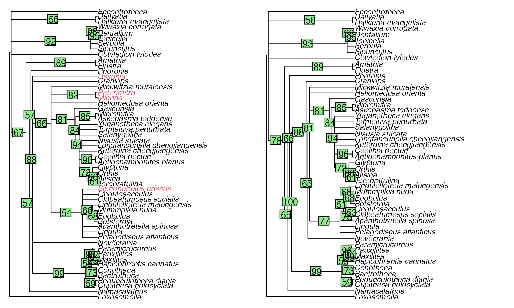

# Detecting rogue taxa in Bayesian posterior tree sets

Detecting “rogue” taxa and removing them from summary trees can produce
consensus trees with a higher resolution, and can reveal strong support
for groupings that would otherwise be masked by the uncertain position
of rogues.

The raw output of Bayesian analysis requires a little processing before
rogue taxa can be identified and explored using the “Rogue” R package.

The workflow presented here should be reasonably easy to adapt for the
output of any Bayesian phylogenetic analysis, but if you hit snags or
get stuck please let me know by [filing a GitHub
issue](https://github.com/ms609/Rogue/issues/new?title=Bayesian+vignette)
or by e-mail.

## Set up

Let’s start by loading the packages we’ll need:

``` r
library("TreeTools") # Read and plot trees
library("Rogue") # Find rogue taxa
```

We’ll work with some example data generated from a morphological
analysis of early brachiopods (Sun et al., 2018) using
[MrBayes](https://nbisweden.github.io/MrBayes/) (Hulsenbeck & Ronquist,
2001). Our data files are stored on
[GitHub](https://github.com/ms609/hyoliths/tree/master/MrBayes). Let’s
load the results of run 1:

``` r
if (online) {
  dataFolder <- "https://raw.githubusercontent.com/ms609/hyoliths/master/MrBayes/"
  run1.t <- paste0(dataFolder, "hyo.nex.run1.t")
  # Reading 10k trees takes a second or two...
  run1Trees <- ape::read.nexus(run1.t)
  if (packageVersion('ape') <= "5.6.1") {
    # Workaround for a bug in ape, hopefully fixed in v5.6.2
    run1Trees <- structure(lapply(run1Trees, function(tr) {
      tr$tip.label <- attr(run1Trees, 'TipLabel')
      tr
    }), class = 'multiPhylo')
  }
} else {
  # If no internet connection, we can generate some example trees instead
  run1Trees <- structure(unlist(lapply(0:21, function(backbone) {
    AddTipEverywhere(ape::as.phylo(0, nTip = 12), 'ROGUE')
  }), recursive = FALSE), class = 'multiPhylo')
}
```

## Select trees to analyse

Our tree file contains all trees generated. We typically want to discard
a proportion of trees as burn-in:

``` r
burninFrac <- 0.25
nTrees <- length(run1Trees)
trees <- run1Trees[seq(from = burninFrac * nTrees, to = nTrees)]
```

This is a large number of trees to analyse. We could save time for an
initial analysis by thinning our sample somewhat.

``` r
sampleSize <- 100
trees <- run1Trees[seq(from = burninFrac * nTrees, to = nTrees,
                       length.out = sampleSize)]
```

For a full analysis, we ought to consider the output from the other runs
of our analysis, perhaps with

``` r
nRuns <- 4
allTrees <- lapply(seq_len(nRuns), function(run) {
  runTrees <- ape::read.nexus(paste0(dataFolder, 'hyo.nex.run', run, .'t'))
  runTrees <- runTrees[seq(from = burninFrac * nTrees, to = nTrees,
                           length.out = sampleSize / nRuns)]
})
trees <- structure(unlist(allTrees, recursive = FALSE), class = 'multiPhylo')
```

## Initial appraisal

Let’s start by looking at the majority rule consensus tree. It can be
instructive to colour leaves by their instability; here we use the *ad
hoc* approach of Smith (2022).

First let’s define a function to plot a gradient legend:

``` r
plenary <- Consensus(trees, p = 0.5)

par(mar = rep(0, 4), cex = 0.85)
plot(plenary, tip.color = ColByStability(trees))
PlotTools::SpectrumLegend(
  "bottomright", legend = c("Stable", "Unstable"),
  palette = hcl.colors(131, 'inferno')[1:101]
)
```


Some taxa stand out as having a less stable position on the tree than
others. Will removing those taxa reveal enough additional information
about the remaining taxa to compensate for the loss of information about
where those taxa plot?

## Detect rogue taxa

We have a few options for how we evaluate the negative impact of
retaining these rogue taxa in our consensus tree.

[`QuickRogue()`](https://ms609.github.io/Rogue/reference/RogueTaxa.md)
uses the quick heuristic method of Smith (2022);
[`RogueTaxa()`](https://ms609.github.io/Rogue/reference/RogueTaxa.md)
supports Smith’s slower heuristic, which might find a set of rogue taxa
that yield slightly more improvement to a consensus tree; it can also be
configured to employ the RogueNaRok approach (Aberer et al., 2013).

``` r
rogues <- QuickRogue(trees)
# rogues <- RogueTaxa(trees) might do a better job, much more slowly
rogues
```

    ##   num taxNum                taxon rawImprovement       IC
    ## 1   0   <NA>                 <NA>             NA 435.3517
    ## 2   1     49          Paterimitra      68.263028 503.6148
    ## 3   2     44              Micrina      13.384875 516.9996
    ## 4   3     51 Siphonobolus_priscus       5.467555 522.4672
    ## 5   4     53              Ussunia      15.200668 537.6679

``` r
# The first line reports the information content of the plenary tree
rogueTaxa <- rogues$taxon[-1]
```

## Visualize results

Let’s see how these taxa influence the majority rule consensus of our
results. Removing rogues may reveal information by producing reduced
consensus trees with a higher resolution, or with higher split support
values.

``` r
par(mar = rep(0, 4)) # Remove plot margin
par(mfrow = c(1, 2)) # Multi-panel plot
par(cex = 0.85) # Smaller labels

plenary <- Consensus(trees, p = 0.5)
reduced <- ConsensusWithout(trees, rogueTaxa, p = 0.5)

plot(plenary,
     tip.color = ifelse(plenary$tip.label %in% rogueTaxa, 2, 1))
LabelSplits(plenary, SplitFrequency(plenary, trees))
plot(reduced)
LabelSplits(reduced, SplitFrequency(reduced, trees))
```



We can also visualize the locations where our rogue taxa would plot on
the reduced consensus tree: the rogue occurs more frequently at the
brighter locations.

``` r
par(mar = rep(0, 4), cex = 0.8)
whichTaxon <- length(rogueTaxa) # Select an illuminating taxon
positions <- RoguePlot(trees, rogueTaxa[whichTaxon], p = 0.5,
                       legend = "bottomleft", legend.inset = 0.06)
```


## References

Aberer, A. J., Krompass, D., & Stamatakis, A. (2013). Pruning rogue taxa
improves phylogenetic accuracy: An efficient algorithm and webservice.
*Systematic Biology*, *62*(1), 162–166.
<https://doi.org/10.1093/sysbio/sys078>

Hulsenbeck, J., & Ronquist, F. (2001). MrBayes: Bayesian inference of
phylogeny. *Bioinformatics*, *17*, 754–755.

Smith, M. R. (2022). Using information theory to detect rogue taxa and
improve consensus trees. *Systematic Biology*, *71*(5), 986–1008.
<https://doi.org/10.1093/sysbio/syab099>

Sun, H., Smith, M. R., Zeng, H., Zhao, F., Li, G., & Zhu, M. (2018).
Hyoliths with pedicles illuminate the origin of the brachiopod body
plan. *Proceedings of the Royal Society B: Biological Sciences*,
*285*(1887), 20181780. <https://doi.org/10.1098/rspb.2018.1780>
